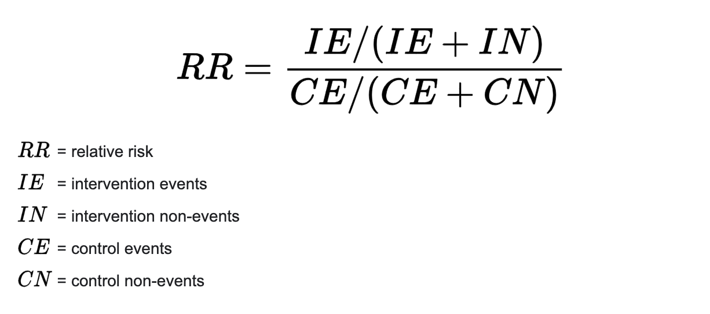

```{r setup, include=FALSE}
knitr::opts_chunk$set(echo = TRUE)

# load packages
require(tidyverse) # data manipulation and plotting
require(here) # relative paths
```

# Calculate risk ratios as a measure of effect size

Bring in the data with the subset of studies 

```{r}
rr_data <- read_csv(here("data", "Taxa_effectsize.csv")) %>% 
  select(-starts_with("X")) # get rid of extra columns read_csv brings in
```

Apply the HA correction and calculate odds ratios

```{r}
HAcorrection <- 0.5 # Haldane‐Anscombe correction (add 0.5 to all cells to avoid dividing by zero)

# calculate the risk ratios (RRs) 
RR <- rr_data %>% 
  # apply correction for zero data
  mutate(Treat_response = Treat_response + HAcorrection) %>% 
  mutate(Treat_n = Treat_n + HAcorrection) %>% 
  mutate(Control_response = Control_response + HAcorrection) %>% 
  mutate(Control_n = Control_n + HAcorrection) %>% 
  # calculate RR
  mutate(RR = (Treat_response/Treat_n) / (Control_response/Control_n))
```

Note that the risk ratio is calculated as:



# Plot it

Plot as a boxplot--to get the PDF version run the code without the hastags/pound signs.

```{r}
# pdf(here("figures/Figure_3.pdf"), width = 6, height = 3.5)

RR %>% 
  ggplot(aes(x = Corallivore_family, y = RR)) +
  geom_boxplot(fill = "lightblue", color = "slategray") +
  geom_point(color = "slategray") +
  geom_hline(yintercept = 1, linetype = "dashed") +
  theme_classic() +
  ylab("Risk ratio") +
  xlab("Corallivore family") +
  theme(axis.text.x = element_text(angle = 35, hjust=1)) 

# dev.off()

```

# Get means

Get means for each group to mention in the text, as suggested by Reviewer 2

```{r}
RR %>% 
  group_by(Corallivore_family) %>% 
  summarize(Mean_RR = mean(RR),
            Count = n()) %>% 
  arrange(-Mean_RR)
```

